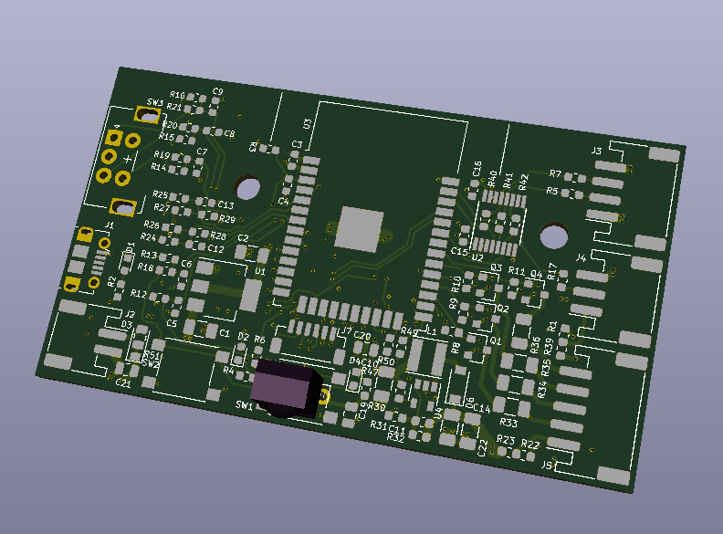
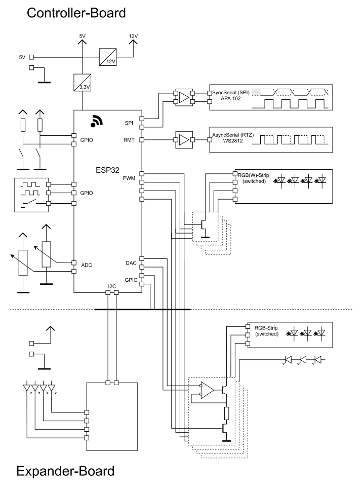
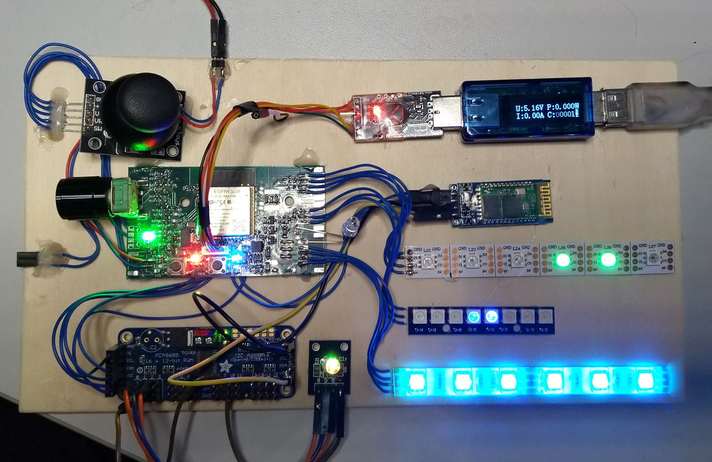
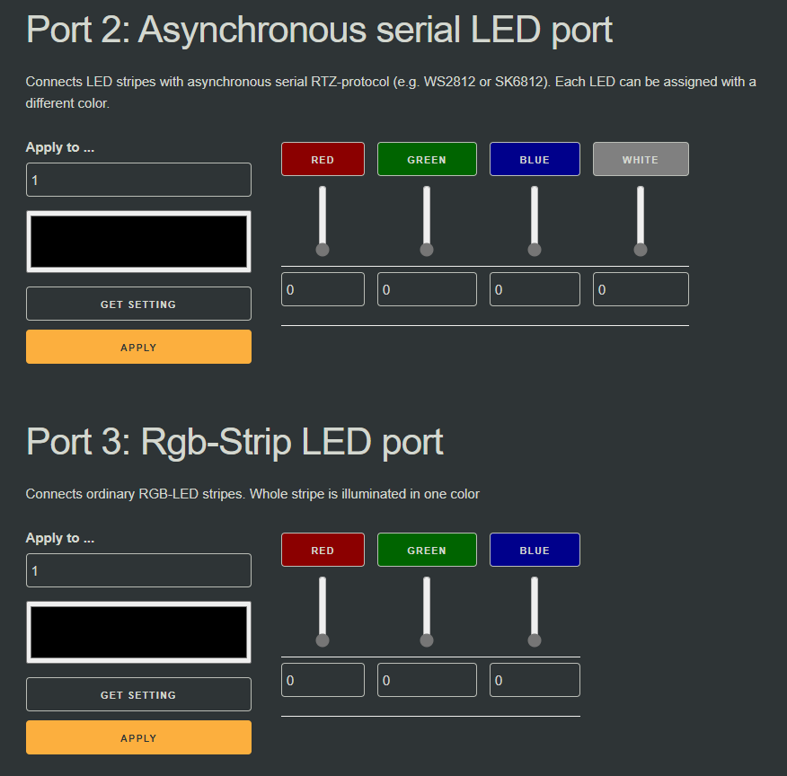

# LightController

A ESP32 based LED-Controller for various light scenarios.

## Purpose

This project is intended to be used as base platform for various Light projects. Its based on the ESP32 WiFi SoC and utilizes the Espressif development framework (ESP-IDF). 

On top of that this is a small hardware and board abstraction layer that simplifies the hardware access and provides further bases for device implementation.

The main purpose is of course to have fun an learn several new techniques and hacks. I also hoped to dig into a promising WiFi platform that enables a wide band of applications. As I happily discovered it was absolutely worth the time and I'm glad that I didn't stuck to arduino.

The intended Products that should result from this are extreme fancy night lights for bedrooms of my children and the stairwell and low key disco lights / ambient lights for the living room.

## Platform

This platform is capable of driving most LEDs I encountered so far (at least the very most common LEDs I have seen so far). 

- Ordinary RGB-Stripes (optionally with white channel)
- Serial LED-Stripes of both both types
  - Most common WS2812 (with RTZ-protocol)
  - Less common APA102 (with easy to use SPI)
- I2C-Expander for single or chains of LEDs

The main board integrates two switches, two analogue inputs and 1 encoder to be integrated in controlling of the station. It also can utilize a UART interface to other protocol bridges or a infrared interface which are also both prepared (the IR-Interface would come at cost of one digital function).

The board also aims to drive short LED-strips solidly with 5 V power supply. Hence it integrates also a small boost-converter.

The next picture shows a block diagram of the platform. Note that the expander board is not designed yet and the main-board will be eventually redesigned to be smaller an perhaps also provide a battery management circuitry.

The next picture shows the first Device I build up. It is solidly for implementation purpose.

The next picture shows a web GUI page to control the LED colors. It currently only supports to control exactly the first LED of each channel.

## Usage

There is currently not very much useful stuff going on. But to get faster familiar with this project this could help you to read. 

The device is flashed in three steps. One can use the VS-Tasks defined in the Firmware-Project for it:
 - `Flash & Monitor`: Builds and flashes the app to target. Note that certain config files will be remain missing until also the parameter partition and webserver partition is also flashed.
 - `Flash Data-Image`: Flashes the config files on the parameter partition (therefor the folder *factoryCfg* is packed to binary and flashed)
 - `Flash Web-Image`: Flashes the files for the webserver to the server partition (therefor the folder *serverPages* is backed to binary and flashed)

After powerup the device provides a WiFi-access point. 

- SSID `cLight`
- Password `FiatLux!`

You can connect to the device and display the root page by typing e.g. "192.168.4.1/" (at least in my case). On this page you see some (currently) little relevant in formation and can navigate to set up your WiFi-parameter or to setup the Lights.

- If you setup the WiFi-parameter the next time the device will try to connect to the provided station. You can Reset the parameter by pressing button 1 at start up 
- If you setup the LEDs you currently can only setup the first LED-slave.

## Development

The development is done in *Visual Studio Code* so far. To be able to join the development you must have the [IDF](https://docs.espressif.com/projects/esp-idf/en/latest/esp32/get-started/index.html) installed. Add also the path to the installed *IDF* as system path variable.

**Note**: This project is based on the idf version `ESP-IDF v4.2-dev-1034-ge599b794b`. I missed the step to stick to a certain tag or something. Sorry for that. You pretty sure will have to make minor adaptions on things like Queues or Wifi parameter.

However, to be able to compile the code you must start vs code from command line with exported environment variables

- Open console in your project path
- Type `%IDF_PATH%\export.bat` to setup the environment for used toolchain
- Type `code .` to open current path in *VS Code* 
- No you are able to start build-process by just hitting `Ctrl+Shift+B`

To be able to flash your ESP you need a USB to UART bridge, that also exposes RTS and DTR pins. These are needed to reset and set the ESP32 into programming mode.

## Architecture
- The main applications instantiates the driver and starts the web server. 
- Each component is in charge of an more or less well defined part of the whole structure
    - Filesystem reads the files from data-storage and partly interprets them
    - LightEffect is in charge of conduction the soft switching of the lights and provides all color definitions
    - MyConnect is a component to establish wifi connection by either providing a network in Access-Point mode or connection to an Access-Point.
    - MyWeb provides the http-server and the Rest-API
    - MyHal is a composite of simple c++ modules to simplify the usage of the SoC hardware
    - Devices utilizes MyHal to drive different devices connected to the main board
- The flash is divided in 3 main partitions. 
    - Program flash
    - Data-storage
    - Web-storage
- The web-server is build in a way similar to a single-page-application manner, but not that strictly. Most content is intended to be generated dynamically on page. The data is intended to be set or fetched via rest-requests.
- Device-IDs and device configuration are read from data-storage. The http-webserver, provides the
    whole webpage from web-storage. 

**Note**: Many of the components are partly ore even mostly tested by unit-tests (that are run locally on the computer not on the SoC). Currently catch2 is used as test-framework.

**Note**: You can also use the ServerMock.py script to emulate parts of the behavior of the http-webserver. At least display and the navigation across the websites. Also partly demo data is already generated.

## Issues

This project is anything but finished. I have several open tasks and they somehow appear to increase rather than getting less. 

- Status LEDs don't display any status yet (just fancy blink codes).
- Linear power states with configurable current flow are not designed yet.
- Wide parts are written more in c-style rather than c++. Sorry i was a little in hurry

## ToDos

- OverTheAirUpdates would be nice
- Design for linear Endstage (expander board)
- Adaption of ZigBee
- Logging should be switched to network path. Means some network placed destination must be configured as logging destination. 
